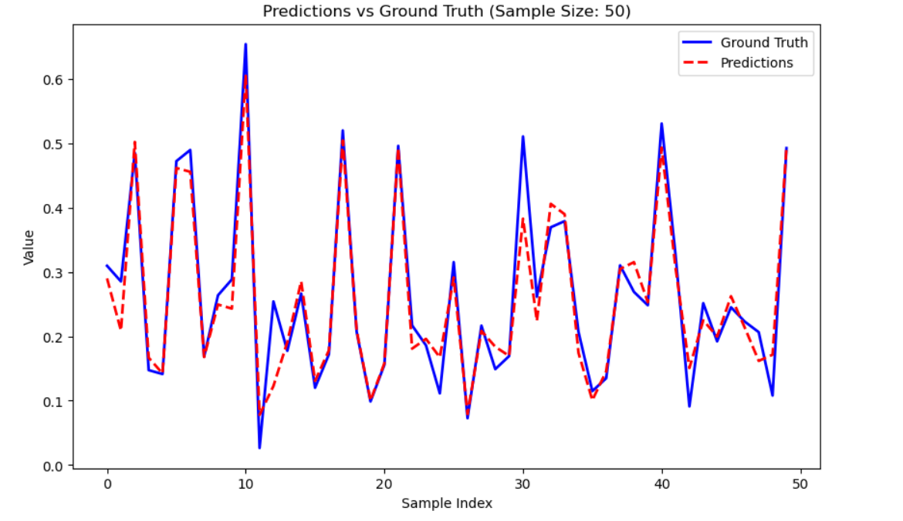

# Power Consumption prediction
Future power consumption prediction using **LSTM**, **GRU**, and **Transformer** models.

Date of creation: August, 2024 <br/>

## Info
**Data** consists of 52,416 observations of energy consumption on a 10-minute window. Every observation is described by 9 feature columns. Additional info on the dataset can be found [here](https://www.kaggle.com/datasets/fedesoriano/electric-power-consumption).  
Each one of the 3 implemented models suitable for time sequence analysis **LSTM**, **GRU**, and **Transformer** learns the relations between the features in the sequences and predicts the future power consumption in the specified zone.

## Quickstart

1. `git clone https://github.com/AStroCvijo/Power_Consumption_Prediction`
2. Download the [DATA](https://www.kaggle.com/datasets/fedesoriano/electric-power-consumption) and paste the csv file in Power_Consumption_Prediction/data
3. `cd Power_Consumption_Prediction`
4. `python -m venv venv`
5. `venv/bin/activate`
6. `pip install -r requirements.txt`
7. `python main.py --train`

## Arguments guide 

### Training arguments
`-t or --train` whether you want to train the model  
`-e or --epochs` number of epochs in training  
`-lr or --learning_rate` learning rate in training  

### Data arguments
`-sl or --sequence_length` length of the sequences extracted from the data  
`-ps or --prediction_step` how far in the future to predict (1 = 10min, 10 = 100min)  
`-pt or --prediction_target` which of the three zones' power consumption to predict: `PowerConsumption_Zone1`, `PowerConsumption_Zone2`, or `PowerConsumption_Zone3`

### Model arguments
`-m or --model` followed by the model you want to use: `LSTM`, `GRU`, or `Transformer`  
`-mn or --model_name` followed by the name of the model you want to use  
`-l or --load` followed by the path to the model you want to load  

#### LSTM and GRU specific arguments
`-hs or --hidden_size` size of the hidden layer in the LSTM or GRU models  
`-nl or --number_of_layers` number of layers in the LSTM or GRU models  

#### Transformer specific arguments
`-md or --model_dimensions` dimensions of the Transformer model  
`-ah or --attention_heads` number of attention heads in the Transformer model

## Example

Predictions vs Ground Truth data for the PowerConsumption_Zone3 10 hours in advance. <br/>
Details:
model - LSTM, hidden_size - 75, number_of_layers - 2, epochs - 5, learning_rate - 0.001

## Folder Tree
```
Power_Consumption_Prediction
│   main.py
│   requirements.txt
│
├───data
│       data_functions.py
│       powerconsumption.csv
│
├───models
│       GRU.py
│       LSTM.py
│       Transformer.py
│
├───pretrained_models
├───train
│       evaluation.py
│       train.py
│
└───utils
        argparser.py
```

## Citation

fedesoriano. (August 2022). Electric Power Consumption. Retrieved [Date Retrieved] from https://www.kaggle.com/datasets/fedesoriano/electric-power-consumption.
